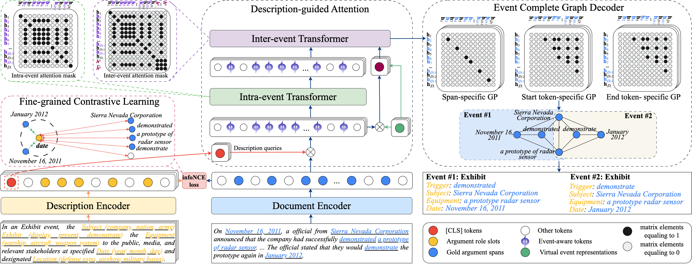

# Incorporating Schema-Aware Description into Document-Level Event Extraction

The codes for "Incorporating Schema-Aware Description into Document-Level Event Extraction". (IJCAI2024)
## Framework



## Folder Structure

The structure of the folder is shown below:

```csharp
 Schema-Aware-Description-DEE
 ├─data
 ├─outputs
 ├─PLMs
 ├─utils
 ├─requirements.txt
 ├─model.py
 ├─train.py
 ├─run.sh
 └README.md
```

Introduction to the structure of the folder:

- /data: Put the dataset in this folder.
- /output: The generated models, results, and logs for the training are stored in this folder.
- /PLMS: The backbone pre-trained language models are stored in this folder.
- /utils: The various settings and hyper-parameters of our method are stored in this folder.
- requirements.txt: Required libraries.
- model.py: the three main components of our method.
- train.py: the main implementation code of our method.
- run.sh: To run our method.
- README.md: Instruction.

## Requirements

All experiments are implemented on the NVIDIA RTX 3090Ti GPU with the PyTorch. The version of Python is 3.7.16.

Please run as follows to install all the dependencies:

```shell
pip3 install -r requirements.txt
```

## Usage

### Preparation

1. Download the pre-trained language models in the ./PLMs folder:

roberta-base: https://huggingface.co/hfl/chinese-roberta-wwm-ext

roberta-large: https://huggingface.co/roberta-large


### Example: Joint extraction on FNDEE benchmark:

2. Run the code with this in the shell:

```shell
./run.sh
```

### Change the settings for other datasets and ablation study
3. Change the arguments in the args.py:

```shell
./utils/args.py
```


## Citation:

If you find the repository helpful, please cite the following paper

```r
@inproceedings{xu2024seele,
  title={Incorporating Schema-Aware Description into Document-Level Event Extraction},
  author={Xu, Zijie and Wang, Peng and Ke, Wenjun and Li, Guozheng and Liu, Jiajun and Ji, Ke and Chen, Xiye and Wu, Chenxiao},
  booktitle={IJCAI},
  year={2024}
}
```